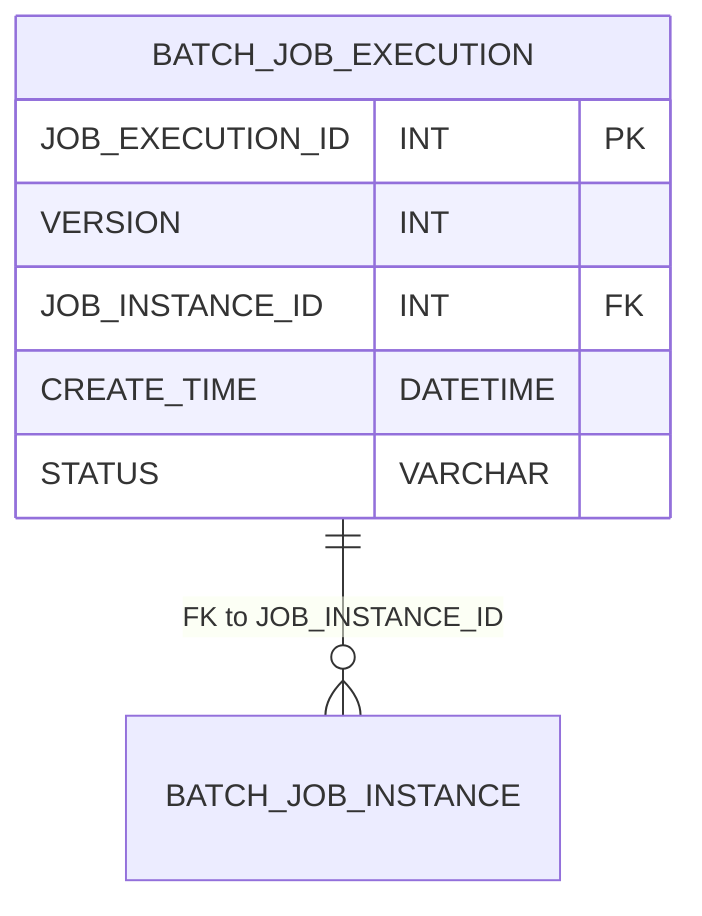

# SQL to Mermaid ERD Converter

A Python script that converts SQL CREATE TABLE statements to Mermaid Entity Relationship Diagram (ERD) syntax.

## Features

- Parses SQL CREATE TABLE statements
- Extracts table names, column definitions, primary keys, and foreign keys
- Generates valid Mermaid ERD syntax
- Maps SQL data types to Mermaid-compatible types
- Handles foreign key relationships with proper cardinality

## Usage

```bash
python sql2mmderd.py <input_sql_file> [output_mermaid_file]
```

### Examples

```bash
# Generate Mermaid ERD and display to console
python sql2mmderd.py schema.sql

# Generate Mermaid ERD and save to file
python sql2mmderd.py schema.sql output.mmd
```

## Output Format

The script generates Mermaid ERD syntax that can be used in:
- GitHub markdown files
- Mermaid Live Editor
- Documentation tools that support Mermaid

### Example Output



## Requirements

- Python 3.x
- No external dependencies (uses only standard library)

## License

MIT License 